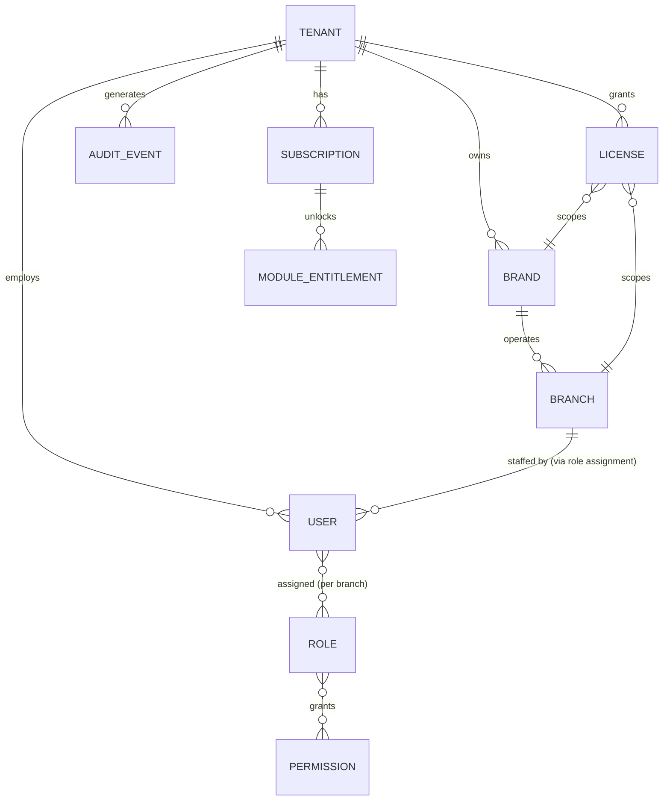
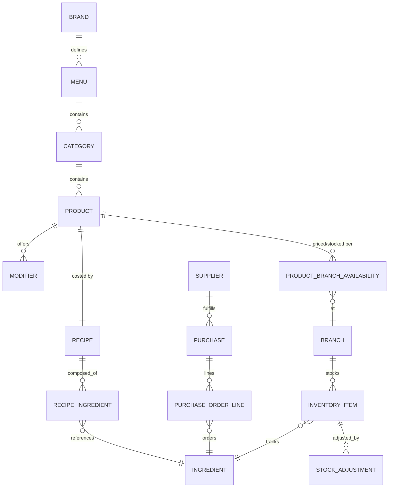
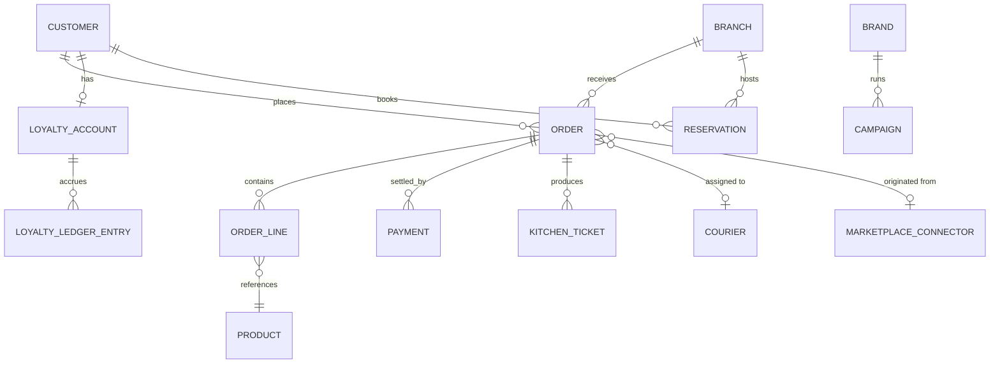
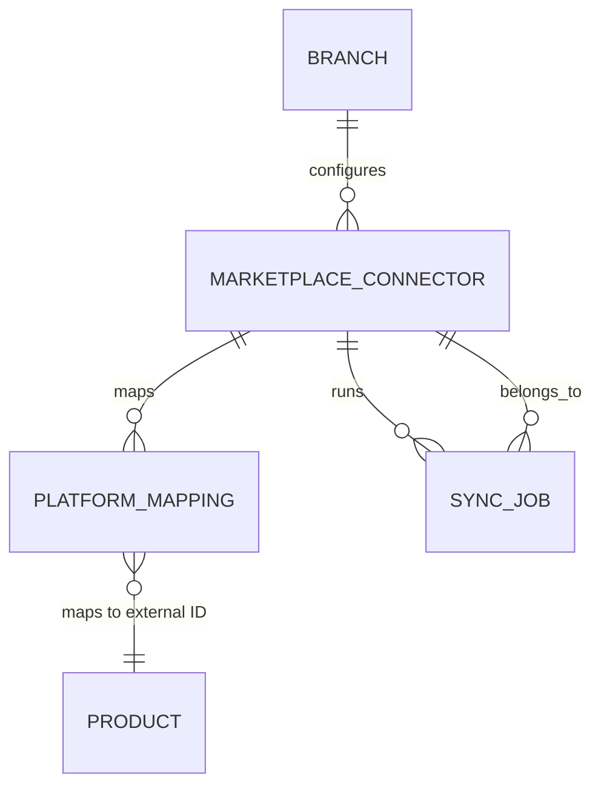

# Abaküs One — Domain Architecture

> Target-state domain model for the full Restaurant Operating System described in the product
> vision. **None of this exists in the current codebase** (see `docs/current_state_audit.md`) —
> the current app has a `CartItemModel`, `OrderModel`, `ProductModel`-shaped mock data, and nothing
> else on this list. This document defines what the domain needs to become, not what it is today.
> It is the shared reference for `docs/module_catalog.md` and `docs/master_roadmap.md`.

## 1. Modeling principles

1. **Tenant is the root of everything.** Every other entity is reachable from a `Tenant` either
   directly or via `Brand`/`Branch`. There is no global, tenant-less data except platform-level
   catalogs (e.g. a shared ingredient taxonomy template) that tenants opt into.
2. **Brand vs. Branch are distinct.** A `Tenant` (the commercial customer, e.g. "Abaküs Bowl A.Ş.")
   owns one or more `Brand`s (a concept/menu identity, e.g. "Abaküs Bowl", "Abaküs Express"), and
   each `Brand` operates at one or more `Branch`es (physical or virtual locations). Franchising and
   white-label both hang off this split: a franchisee is a `Tenant` licensed to operate a `Branch`
   under someone else's `Brand`.
3. **Menus are Brand-scoped by default, Branch-overridable.** A `Product`'s existence and recipe
   are Brand-level; its price, stock, and availability are Branch-level (`ProductBranchAvailability`).
4. **Money math never lives on the mobile client.** Recipe costing, profitability, and payment
   settlement are backend/domain-service concerns; the app only ever displays results.
5. **Every mutating action is an audit event.** `AuditEvent` is not a bolt-on log table — it is a
   first-class entity referenced by the identity, menu, inventory, and order domains from day one,
   because retrofitting audit trails into a live commercial product is far more expensive than
   building them in.
6. **Orders are channel-agnostic.** An `Order` looks the same whether it came from the customer
   app, web, QR, POS, or a marketplace connector — the `channel` and `MarketplaceConnector`
   reference are metadata on the order, not a different data shape per channel.

## 2. Entity catalog

| Entity | Purpose | Key fields (illustrative, not exhaustive) | Belongs to / scoped by |
|---|---|---|---|
| **Tenant** | The commercial customer of Abaküs One (a restaurant group, single owner, or franchisor). | id, legalName, status, planId | root |
| **Brand** | A concept/menu identity a Tenant operates under. | id, tenantId, name, whiteLabelConfigId | Tenant |
| **Branch** | A physical or virtual location operating a Brand's menu. | id, brandId, tenantId, name, address, geo, timezone, operatingHours | Brand |
| **User** | A human identity (staff, owner, or admin) able to authenticate. | id, tenantId, name, contact, authProviderRef | Tenant (assignable to Branches via Role) |
| **Role** | A named set of Permissions (e.g. "Branch Manager", "Kitchen Staff", "Franchise Owner"). | id, tenantId or platform-level, name, isSystemRole | Tenant or Platform |
| **Permission** | An atomic capability check (e.g. `orders.refund`, `menu.publish`). | id, key, module | Platform (fixed catalog) |
| **Customer** | An end-consumer identity, distinct from `User` (staff). | id, tenantId or brandId, name, contact, marketingConsent | Tenant/Brand |
| **Menu** | A named, versioned collection of Categories for a Brand. | id, brandId, name, version, publishedAt | Brand |
| **Category** | A grouping of Products within a Menu. | id, menuId, name, sortOrder | Menu |
| **Product** | A sellable item definition. | id, categoryId, brandId, name, basePrice, recipeId | Category / Brand |
| **ProductBranchAvailability** | Branch-level override of a Product's price/stock/visibility. | productId, branchId, price, isAvailable, stockOverride | Product + Branch |
| **Ingredient** | A shared, tenant-wide raw-material catalog entry. | id, tenantId, name, unit, allergenTags | Tenant |
| **Recipe** | The ingredient composition + yield of a Product. | id, productId, yieldQty | Product |
| **RecipeIngredient** | Join entity: quantity of an Ingredient used per Recipe. | recipeId, ingredientId, quantity, unit | Recipe + Ingredient |
| **Modifier** (Group + Option) | Customer-facing customization options for a Product. | id, productId, groupName, options[] | Product |
| **InventoryItem** | Current stock level of an Ingredient at a Branch. | id, branchId, ingredientId, quantityOnHand, reorderThreshold | Branch + Ingredient |
| **StockAdjustment** | A manual correction, waste, or transfer event against an InventoryItem. | id, inventoryItemId, delta, reason, actorUserId | InventoryItem |
| **Supplier** | A vendor a Tenant purchases Ingredients from. | id, tenantId, name, contact, paymentTerms | Tenant |
| **Purchase** (PurchaseOrder) | An order placed with a Supplier for one or more Ingredients. | id, supplierId, branchId, status, expectedDate | Supplier + Branch |
| **PurchaseOrderLine** | An Ingredient + quantity + cost line on a Purchase. | purchaseId, ingredientId, quantity, unitCost | Purchase + Ingredient |
| **Order** | A customer transaction, channel-agnostic. | id, branchId, customerId, channel, status, totals, marketplaceConnectorId? | Branch + Customer |
| **OrderLine** | A Product (+ chosen Modifiers) + quantity + price on an Order. | orderId, productId, modifierSelections, quantity, unitPrice | Order + Product |
| **Payment** | A settlement attempt/result against an Order. | id, orderId, providerAdapterKey, amount, status | Order |
| **KitchenTicket** | The kitchen-facing work item derived from an Order (or part of one). | id, orderId, branchId, station, status, firedAt, readyAt | Order + Branch |
| **Courier** | A delivery agent (in-house or third-party) assignable to an Order. | id, tenantId or branchId, name, vehicleType, status | Branch |
| **Loyalty** (Account + LedgerEntry) | A Customer's points balance and history, per Tenant/Brand program. | accountId, customerId, balance; ledgerEntry: delta, reason, orderId? | Customer + Brand |
| **Campaign** | A time-boxed promotion or coupon program. | id, brandId or tenantId, rules, couponCode, validity | Brand/Tenant |
| **Reservation** | A booked table/time slot at a Branch. | id, branchId, customerId, partySize, timeSlot, tableRef, status | Branch + Customer |
| **MarketplaceConnector** | Configuration for one external ordering platform integration, per Branch. | id, branchId, platform (enum: Yemeksepeti/GetirYemek/TrendyolYemek/MigrosYemek/TruYemek), credentialsRef, status | Branch |
| **PlatformMapping** | Maps an internal entity (Product/Category/Modifier) to its external-platform equivalent ID. | connectorId, internalEntityType, internalId, externalId | MarketplaceConnector |
| **SyncJob** | A tracked run of an outbound/inbound sync (menu, price, stock, image, availability, order pull). | id, connectorId, jobType, status, startedAt, errorLog | MarketplaceConnector |
| **AuditEvent** | An immutable record of a mutating action anywhere in the system. | id, tenantId, actorUserId, action, entityType, entityId, timestamp, diff | Tenant |
| **Subscription** | A Tenant's commercial plan and billing state. | id, tenantId, planId, status, renewsAt | Tenant |
| **License** | A specific entitlement grant (e.g. a franchise Branch's right to operate under a Brand). | id, tenantId, scope (tenant/brand/branch), termEndsAt | Tenant/Brand/Branch |
| **ModuleEntitlement** | Which modules/feature flags a Subscription or License unlocks. | subscriptionOrLicenseId, moduleKey, isEnabled, limits (e.g. maxBranches) | Subscription/License |

## 3. Relationship diagrams

### 3.1 Tenancy, identity, and access

### 3.2 Menu, product, and inventory

### 3.3 Order lifecycle and operations

### 3.4 Marketplace integration and sync

## 4. Cross-cutting invariants

- A `Product` can exist without any `ProductBranchAvailability` (unpublished); it cannot be ordered
  until at least one exists with `isAvailable = true`.
- An `Order` always has a `branchId`; multi-branch reporting/CRM aggregate up through
  `Branch → Brand → Tenant`, never the reverse.
- `AuditEvent` is append-only; nothing in the domain model ever hard-deletes a row that has ever
  been referenced by an `AuditEvent`, `Order`, or `Payment` — corrections are new rows/adjustments,
  not mutations of history.
- `Permission` is a fixed platform catalog (versioned with the app/backend release); `Role` is
  tenant-editable composition of `Permission`s, except a small set of system roles that cannot be
  edited or deleted (e.g. "Tenant Owner").
- `ModuleEntitlement` is checked at the API boundary, never solely in the Flutter client — mirrors
  the existing architecture bible rule that admin UI must not be the only gate.
