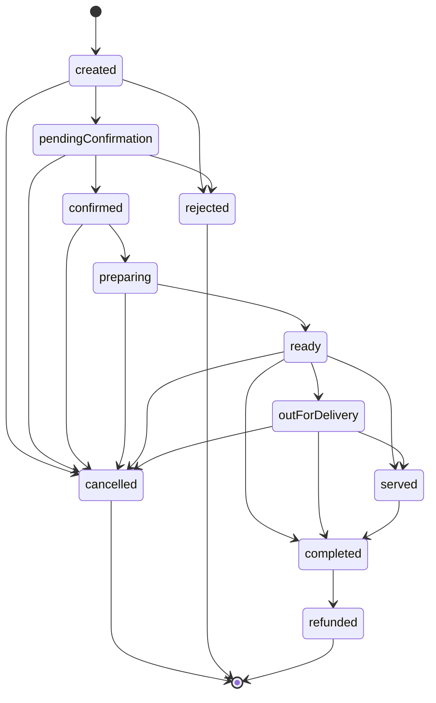

# Order Lifecycle & Reliability Foundation

> Status: domain foundation only, as originally written. **This status line is now stale** — a real,
> server-authoritative order-lifecycle backend exists today (`functions/src/orderLifecycle.ts`,
> `advance*OrderStatus.ts`, real `auditEvents` writes), far beyond what this document's own "no backend"
> framing describes; left as an honest historical snapshot rather than silently rewritten, per the same
> discipline `docs/table_qr_architecture.md` already established for itself.
>
> **Superseded for Admin/POS-relevant content (2026-08-26, AP-1) by `docs/
> order_operations_architecture.md`** — see that document, `docs/admin_pos_architecture.md` §15, and
> `docs/decisions.md`'s AP-0/AP-1 entries for the current, evidence-backed state.
>
> **§9's `CartItem`/`CartItemModel` claim corrected (2026-08-26, AP-1, direct source verification)**:
> §9 below states the duplication is "still unresolved." Current source confirms only `CartItem`
> (`lib/features/cart/domain/models/cart_item.dart`) exists — `CartItemModel` has zero remaining
> references anywhere in `lib/`. `docs/menu_experience_architecture.md`'s "the duplicate was deleted"
> claim is the accurate one; this document's own §9 claim is the stale one, corrected here rather than
> silently rewritten below.

> Status: domain foundation only. No backend, persistence, payment, or kitchen/POS integration
> exists yet — see §7/§8 for what's explicitly deferred. This is the shared lifecycle model every
> ordering channel (QR table orders, POS, takeaway, delivery, reservation preorders) is meant to
> build on, extending `docs/table_qr_architecture.md`'s `OrderChannel` work.

## 1. Order state machine

### Why a new field instead of changing `OrderModel.status`

`OrderModel.status` is a `String` the current order-history UI (`orders_screen.dart`,
`order_detail_screen.dart`) reads and compares directly — e.g. `order.status == 'Teslim Edildi'`,
and displays it verbatim as a label. Changing its type would require touching that UI, which this
phase is explicitly scoped not to do, and would break every existing comparison.

Instead, `OrderModel` gained a second, **canonical** field: `lifecycleStatus` (type `OrderStatus`,
default `OrderStatus.created`). The two fields serve different purposes and are expected to
diverge in practice until the UI is migrated:

| Field | Type | Purpose | Audience |
|---|---|---|---|
| `status` | `String` | Localized, human-facing label | Current order-history screens (unchanged) |
| `lifecycleStatus` | `OrderStatus` enum | Canonical, machine-readable state | The state machine below, and every future channel/backend/kitchen integration |

This is not a duplicate concept — it's a legacy display field and its intended canonical
replacement, coexisting during a migration that hasn't happened yet. No code in this phase
attempts to derive one from the other; mapping the existing free-form Turkish strings
(`'Hazırlanıyor'`, `'Onay Bekliyor'`, ...) onto `OrderStatus` values is a UI-migration task for a
later phase, not a safe inference to make now.

### States

```text
created, pendingConfirmation, confirmed, preparing, ready, outForDelivery,
served, completed, cancelled, rejected, refunded
```

### State diagram



### Transition table

| From | Valid next states | Rationale |
|---|---|---|
| `created` | `pendingConfirmation`, `cancelled`, `rejected` | Order captured client-side; can be withdrawn or immediately rejected before any restaurant action. |
| `pendingConfirmation` | `confirmed`, `rejected`, `cancelled` | Awaiting restaurant acceptance. |
| `confirmed` | `preparing`, `cancelled` | Accepted; can still be cancelled before kitchen work starts. |
| `preparing` | `ready`, `cancelled` | Kitchen is actively working it; cancellation still possible (e.g. can't fulfill), but not a "rejection" anymore since it was already confirmed. |
| `ready` | `outForDelivery`, `served`, `completed`, `cancelled` | Branches by channel: delivery goes `outForDelivery`; dine-in/staff-served goes `served`; self-service takeaway can go straight to `completed`. |
| `outForDelivery` | `served`, `completed`, `cancelled` | Delivery-specific leg; `cancelled` covers a failed/returned delivery. |
| `served` | `completed` | Food is with the customer; only remaining step is closing the order. |
| `completed` | `refunded` | Post-completion disputes/refunds are handled as a distinct terminal-adjacent transition, not a reopened order. |
| `cancelled`, `rejected`, `refunded` | *(none)* | Terminal. |

Explicitly **not** allowed: skipping stages (e.g. `created` → `preparing`), reopening a terminal
state, or cancelling after `served`/`completed` (a served or completed order goes through the
refund path instead — cancellation models "this order will not be fulfilled," which is no longer
true once food has reached the customer).

### Enforcement

`OrderStatusTransitions.canTransition(from, to)` (`lib/features/orders/domain/models/order_status.dart`)
is the single source of truth for the table above — a `Map<OrderStatus, Set<OrderStatus>>` const
lookup, plus `allowedNextStates`/`isTerminal` helpers. No other code in this phase calls it yet
(there is no order-mutation flow to call it from); it exists so the first thing that *does* mutate
an order's `lifecycleStatus` has one correct place to check against, rather than reinventing the
rules.

## 2. Order snapshot strategy

`OrderItemSnapshot` (`order_item_snapshot.dart`) freezes `productName`, `modifierDescriptions`,
`quantity`, `unitPrice`, `taxAmount`, `discountAmount`, and `notes` as plain values at order time.

**Deliberately not the same type as the cart's line item** (`CartItem` /
`cart_provider.dart`'s `CartItemModel` — see §9 for a note on that pair's own pre-existing
duplication). A cart line is live: it's meant to keep reflecting the current product/price/
modifiers up until checkout. A snapshot is the opposite by design — once an order exists, a later
menu price change, product rename, or modifier removal must never alter it. That guarantee is
exactly why the snapshot stores `productName`/`modifierDescriptions` as frozen text rather than as
references back to a live product.

`OrderModel.items` is a `List<OrderItemSnapshot>`, defaulting to `const []` — additive, so no
existing order construction breaks.

## 3. Order channels

`OrderChannel` (introduced in the QR table-ordering phase) is unchanged and already integrated
into `OrderModel` as `channel` (default `OrderChannel.delivery`, preserving current behavior).
This phase verified it still covers every required channel: `dineInQr`, `dineInStaff`, `takeaway`,
`delivery`, `reservationPreorder` — no changes were needed.

## 4. Idempotency

`OrderModel` gained three new fields: `requestId`, `createdDeviceId`, `createdSessionId` (all
`String`, default `''`).

**Intended backend behavior (not implemented)**: when an order is submitted, the backend should
treat `requestId` as an idempotency key scoped to the submitting client. If a request with a
`requestId` that's already been processed arrives again (e.g. a retried network call after a
timeout, a double-tap on "place order"), the backend must return the existing order rather than
creating a duplicate. `createdDeviceId` and `createdSessionId` are additional context for fraud/
abuse detection and debugging (e.g. "which guest session created this order" ties directly into
`GuestSession.currentOrderId` from the table-QR architecture), not part of the idempotency key
itself.

Nothing in this codebase generates a `requestId` yet — that's client-side work for the phase that
implements actual order submission.

## 5. Cancellation model

`OrderCancellationInfo` (`reason`, `actor`, `timestamp`) is a single structured value object rather
than three loose fields, so an order's cancellation state can't partially exist (e.g. a reason with
no timestamp). `OrderModel.cancellation` is `OrderCancellationInfo?`, `null` unless the order has
actually been cancelled.

`actor` uses a new `OrderActor` enum (`customer`, `staff`, `kitchen`, `system`) — shared with the
audit foundation below rather than duplicated, since "who cancelled this" and "who made this
audited change" are the same question.

**Coexistence note**: `OrderModel` already had `cancellationReason`/`cancellationDescription`/
`cancelledAt` as three separate nullable `String` fields from earlier work. This phase did not
touch, migrate, or remove them — `cancellation` is purely additive, and the legacy fields remain
exactly as they were for the current UI. Consolidating onto one representation is future UI-
migration work, not done here.

## 6. Order timestamps

`OrderTimestamps` tracks the 7 stages explicitly required: `created` (required), `confirmed`,
`preparing`, `ready`, `served`, `completed`, `cancelled` (all nullable). `recordedAt(status, at)`
maps an `OrderStatus` to the correct field and returns an updated copy; statuses outside the
tracked 7 (`pendingConfirmation`, `outForDelivery`, `rejected`, `refunded`) leave the instance
unchanged rather than erroring — a deliberate choice so a caller can pass every transition through
`recordedAt` uniformly without special-casing which ones are tracked.

`OrderModel.timestamps` is `OrderTimestamps?`, defaulting to `null`. It could not default to a
constructed instance (that would require `DateTime.now()`, which isn't `const`-safe and would have
forced dropping `OrderModel`'s `const` constructor — a much larger, unwanted change). Callers that
care about timing construct one explicitly.

## 7. Audit foundation

`OrderAuditEntry` (`id`, `type`, `description`, `actor`, `timestamp`, optional `previousValue`/
`newValue`) covers the three change types requested: `OrderAuditChangeType.statusChange`,
`.priceChange`, `.manualAdjustment`. A `OrderAuditEntry.statusChange(...)` factory covers the most
common case (a lifecycle transition) with a consistent description format.

`OrderModel.auditTrail` is `List<OrderAuditEntry>`, default `const []` — append-only by
convention (nothing in this phase removes or mutates existing entries, only `copyWith`s a new list
that includes them).

**No persistence.** This is purely an in-memory shape. A real audit trail needs durable, tamper-
evident storage — tracked as backend work, not something a Flutter domain model can provide on its
own.

## 8. Future integrations

- **Payment**: `OrderStatus.completed → refunded` is the hook a future payment/refund flow attaches
  to. `OrderCancellationInfo`/`OrderAuditEntry` give a refund flow the same reason/actor/timestamp
  shape cancellation already uses — a refund is expected to become its own small value object
  (`OrderRefundInfo`?) when that phase arrives, following the same pattern, not extending
  `OrderCancellationInfo` itself (a refund and a cancellation are different events with different
  meanings, even though they're metadata-shaped the same way).
- **Kitchen (KDS)**: will consume orders filtered/sorted by `lifecycleStatus` (`confirmed` →
  `preparing` → `ready`) and write `OrderAuditEntry.statusChange` entries with
  `actor: OrderActor.kitchen`. No KDS code exists yet; this phase only ensures the state machine
  and audit shape it will drive already exist and are tested.
- **POS**: `dineInStaff` orders will move through the same `OrderStatus` machine as `dineInQr`
  orders — this was a primary reason for keeping the machine channel-agnostic rather than building
  a QR-specific one.
- **Inventory**: `OrderItemSnapshot.productId` (kept alongside the frozen `productName`) is the
  intended join point — when a real inventory module exists, the transition into
  `OrderStatus.confirmed` (the point an order is guaranteed to be fulfilled, not just requested) is
  the natural hook for stock deduction, keyed by `productId` per line. The frozen `quantity` on
  each `OrderItemSnapshot` is exactly what a deduction needs and won't drift even if the order's
  line items were later displayed against a renamed/repriced product. No deduction logic, stock
  model, or inventory event exists yet — this section only records where the seam belongs so it
  isn't designed inconsistently later.

## 9. Related issue noted, not fixed

`lib/features/cart/domain/models/cart_item.dart` defines `CartItem`, but
`lib/features/cart/presentation/providers/cart_provider.dart` independently defines an
almost-identical `CartItemModel` inline and never imports the real one — flagged in the prior
phase's report and still unresolved. It's unrelated to order lifecycle specifically (it's a
pre-checkout cart bug, not an order one) and was left untouched again this phase per the
no-unrelated-refactoring constraint. Recommend a small, dedicated cleanup task.
